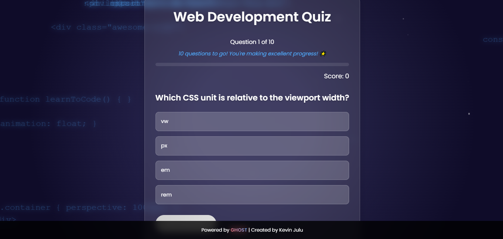

# 🚀 Interactive Web Development Quiz App

A modern, animated quiz application to test and improve your web development knowledge. Built with pure HTML, CSS, and JavaScript.



## ✨ Features

- 🎯 Dynamic question loading with randomized selection
- 🎨 Beautiful animations and floating code effects
- 💡 Real-time feedback and score tracking
- 📱 Fully responsive design
- 🌈 Modern glassmorphism UI
- 🎉 Celebration animations for high scores
- 📚 Curated learning resources
- 💻 Programming quotes for inspiration

## 🛠️ Technologies Used

- HTML5
- CSS3 (with modern animations)
- Vanilla JavaScript
- Animate.css
- Google Fonts (Poppins)

## 🎮 Try It Out

1. Visit the live demo: [Web Dev Quiz App](https://kevinjulu.github.io/interactive-web-dev-quiz)
2. Test your web development knowledge
3. Get instant feedback
4. Explore curated learning resources
5. Share your results!

## 🖥️ Local Development

1. Clone the repository
```bash
git clone https://github.com/Kevinjulu/interactive-web-dev-quiz.git
```
2. Open `index.html` in your browser
3. Start learning!

## 👨‍💻 Author

**Kevin Julu**
- Powered by GHOST
- GitHub: [@kevinjulu](https://github.com/kevinjulu)

## 📄 License

This project is open source and available under the [MIT License](LICENSE).

## 🙏 Acknowledgments

- Animate.css for smooth animations
- Google Fonts for typography
- All the amazing developers who inspire daily learning
